# PyTorch Image Classification

Following papers are implemented using PyTorch.

* ResNet ([1512.03385](https://arxiv.org/abs/1512.03385))
* ResNet-preact ([1603.05027](https://arxiv.org/abs/1603.05027))
* WRN ([1605.07146](https://arxiv.org/abs/1605.07146))
* DenseNet ([1608.06993](https://arxiv.org/abs/1608.06993), [2001.02394](https://arxiv.org/abs/2001.02394))
* PyramidNet ([1610.02915](https://arxiv.org/abs/1610.02915))
* ResNeXt ([1611.05431](https://arxiv.org/abs/1611.05431))
* shake-shake ([1705.07485](https://arxiv.org/abs/1705.07485))
* LARS ([1708.03888](https://arxiv.org/abs/1708.03888), [1801.03137](https://arxiv.org/abs/1801.03137))
* Cutout ([1708.04552](https://arxiv.org/abs/1708.04552))
* Random Erasing ([1708.04896](https://arxiv.org/abs/1708.04896))
* SENet ([1709.01507](https://arxiv.org/abs/1709.01507))
* Mixup ([1710.09412](https://arxiv.org/abs/1710.09412))
* Dual-Cutout ([1802.07426](https://arxiv.org/abs/1802.07426))
* RICAP ([1811.09030](https://arxiv.org/abs/1811.09030))
* CutMix ([1905.04899](https://arxiv.org/abs/1905.04899))

## Requirements

* Ubuntu (It's only tested on Ubuntu, so it may not work on Windows.)
* Python >= 3.7
* PyTorch >= 1.4.0
* torchvision
* [NVIDIA Apex](https://github.com/NVIDIA/apex)

```bash
pip install -r requirements.txt
```

## Usage

```bash
python train.py --config configs/cifar/resnet_preact.yaml
```


## Results on CIFAR-10

### Results using almost same settings as papers

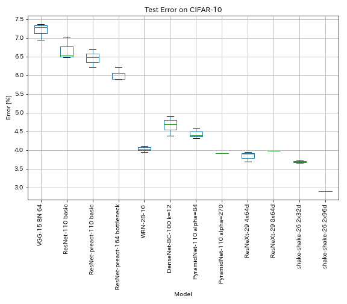

| Model                                  | Test Error (median of 3 runs) | Test Error (in paper)                  | Training Time |
|:---------------------------------------|:-----------------------------:|:--------------------------------------:|--------------:|
| VGG-like (depth 15, w/ BN, channel 64) |           7.29                | N/A                                    |      1h20m    |
| ResNet-110                             |           6.52                | 6.43 (best), 6.61 +/- 0.16             |      3h06m    |
| ResNet-preact-110                      |           6.47                | 6.37 (median of 5 runs)                |      3h05m    |
| ResNet-preact-164 bottleneck           |           5.90                | 5.46 (median of 5 runs)                |      4h01m    |
| ResNet-preact-1001 bottleneck          |                               | 4.62 (median of 5 runs), 4.69 +/- 0.20 |               |
| WRN-28-10                              |           4.03                | 4.00 (median of 5 runs)                |     16h10m    |
| WRN-28-10 w/ dropout                   |                               | 3.89 (median of 5 runs)                |               |
| DenseNet-100 (k=12)                    |           3.87 (1 run)        | 4.10 (1 run)                           |     24h28m*   |
| DenseNet-100 (k=24)                    |                               | 3.74 (1 run)                           |               |
| DenseNet-BC-100 (k=12)                 |           4.69                | 4.51 (1 run)                           |     15h20m    |
| DenseNet-BC-250 (k=24)                 |                               | 3.62 (1 run)                           |               |
| DenseNet-BC-190 (k=40)                 |                               | 3.46 (1 run)                           |               |
| PyramidNet-110 (alpha=84)              |           4.40                | 4.26 +/- 0.23                          |     11h40m    |
| PyramidNet-110 (alpha=270)             |           3.92 (1 run)        | 3.73 +/- 0.04                          |     24h12m*   |
| PyramidNet-164 bottleneck (alpha=270)  |           3.44 (1 run)        | 3.48 +/- 0.20                          |     32h37m*   |
| PyramidNet-272 bottleneck (alpha=200)  |                               | 3.31 +/- 0.08                          |               |
| ResNeXt-29 4x64d                       |           3.89                | ~3.75 (from Figure 7)                  |     31h17m    |
| ResNeXt-29 8x64d                       |           3.97 (1 run)        | 3.65 (average of 10 runs)              |     42h50m*   |
| ResNeXt-29 16x64d                      |                               | 3.58 (average of 10 runs)              |               |
| shake-shake-26 2x32d (S-S-I)           |           3.68                | 3.55 (average of 3 runs)               |     33h49m    |
| shake-shake-26 2x64d (S-S-I)           |           2.88 (1 run)        | 2.98 (average of 3 runs)               |     78h48m    |
| shake-shake-26 2x96d (S-S-I)           |           2.90 (1 run)        | 2.86 (average of 5 runs)               |    101h32m*   |


#### Notes

* Differences with papers in training settings:
    * Trained WRN-28-10 with batch size 64 (128 in paper).
    * Trained DenseNet-BC-100 (k=12) with batch size 32 and initial learning rate 0.05 (batch size 64 and initial learning rate 0.1 in paper).
    * Trained ResNeXt-29 4x64d with a single GPU, batch size 32 and initial learning rate 0.025 (8 GPUs, batch size 128 and initial learning rate 0.1 in paper).
    * Trained shake-shake models with a single GPU (2 GPUs in paper).
    * Trained shake-shake 26 2x64d (S-S-I) with batch size 64, and initial learning rate 0.1.
* Test errors reported above are the ones at last epoch.
* Experiments with only 1 run are done on different computer from the one used for experiments with 3 runs.
* GeForce GTX 980 was used in these experiments.

#### VGG-like

```bash
python train.py --config configs/cifar/vgg.yaml
```

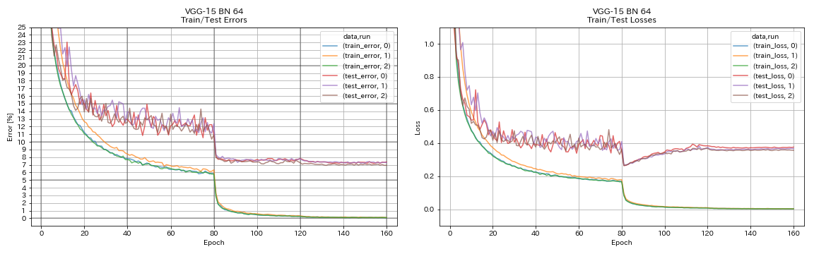


#### ResNet

```bash
python train.py --config configs/cifar/resnet.yaml
```

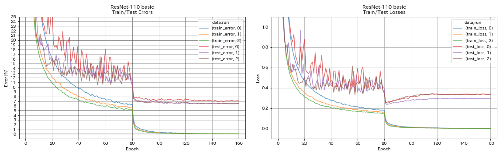


#### ResNet-preact

```bash
python train.py --config configs/cifar/resnet_preact.yaml \
    train.output_dir experiments/resnet_preact_basic_110/exp00
```

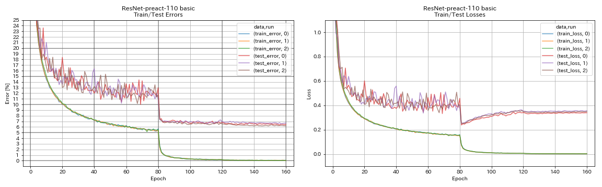


```bash
python train.py --config configs/cifar/resnet_preact.yaml \
    model.resnet_preact.depth 164 \
    model.resnet_preact.block_type bottleneck \
    train.output_dir experiments/resnet_preact_bottleneck_164/exp00
```

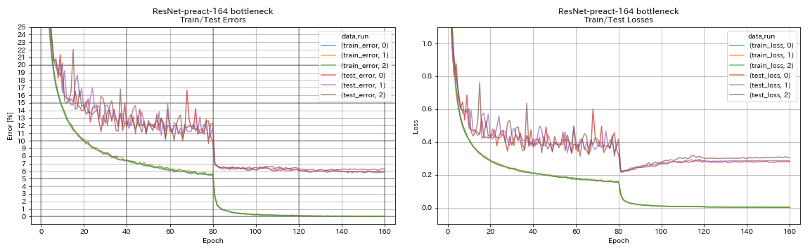


#### WRN

```bash
python train.py --config configs/cifar/wrn.yaml
```

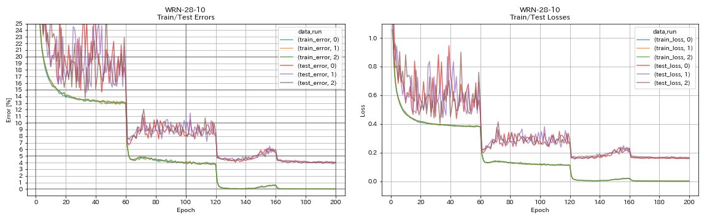


#### DenseNet

```bash
python train.py --config configs/cifar/densenet.yaml
```

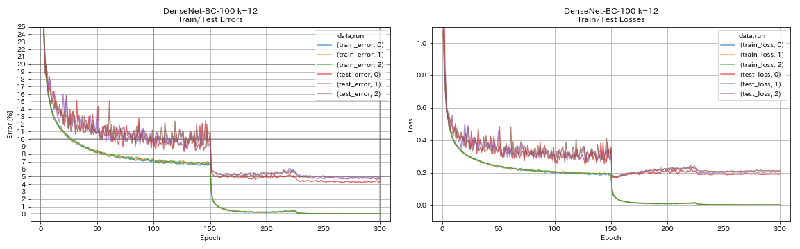


#### PyramidNet

```bash
python train.py --config configs/cifar/pyramidnet.yaml \
    model.pyramidnet.depth 110 \
    model.pyramidnet.block_type basic \
    model.pyramidnet.alpha 84 \
    train.output_dir experiments/pyramidnet_basic_110_84/exp00
```

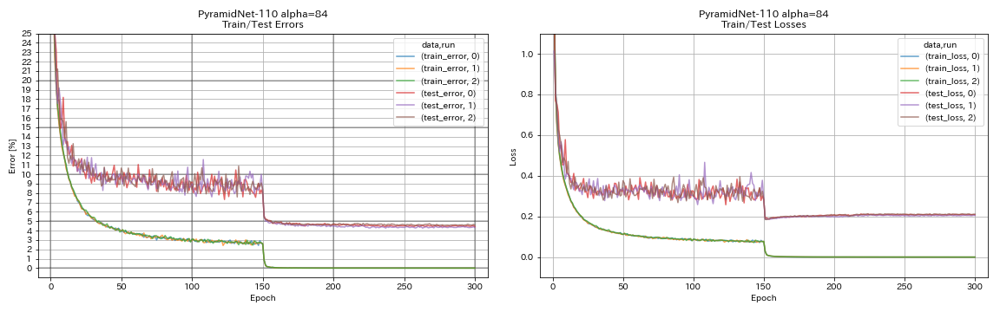

```bash
python train.py --config configs/cifar/pyramidnet.yaml \
    model.pyramidnet.depth 110 \
    model.pyramidnet.block_type basic \
    model.pyramidnet.alpha 270 \
    train.output_dir experiments/pyramidnet_basic_110_270/exp00
```

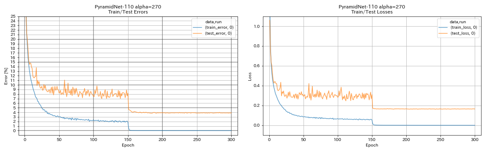


#### ResNeXt

```bash
python train.py --config configs/cifar/resnext.yaml \
    model.resnext.cardinality 4 \
    train.batch_size 32 \
    train.base_lr 0.025 \
    train.output_dir experiments/resnext_29_4x64d/exp00
```


```bash
python train.py --config configs/cifar/resnext.yaml \
    train.batch_size 64 \
    train.base_lr 0.05 \
    train.output_dir experiments/resnext_29_8x64d/exp00
```

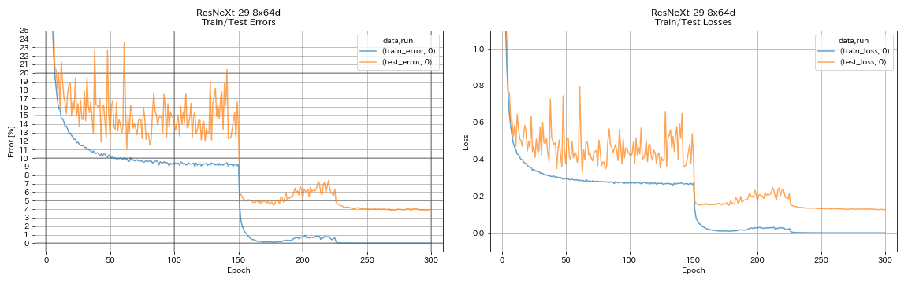


#### shake-shake

```bash
python train.py --config configs/cifar/shake_shake.yaml \
    model.shake_shake.initial_channels 32 \
    train.output_dir experiments/shake_shake_26_2x32d_SSI/exp00
```

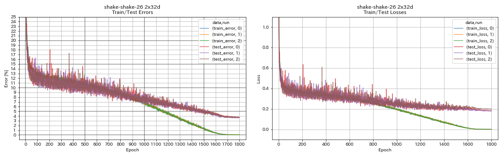

```bash
python train.py --config configs/cifar/shake_shake.yaml \
    model.shake_shake.initial_channels 64 \
    train.batch_size 64 \
    train.base_lr 0.1 \
    train.output_dir experiments/shake_shake_26_2x64d_SSI/exp00
```


```bash
python train.py --config configs/cifar/shake_shake.yaml \
    model.shake_shake.initial_channels 96 \
    train.batch_size 64 \
    train.base_lr 0.1 \
    train.output_dir experiments/shake_shake_26_2x96d_SSI/exp00
```

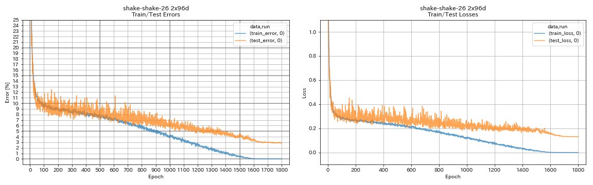


### Results

| Model                                                 | Test Error (1 run) | # of Epochs | Training Time |
|:------------------------------------------------------|:------------------:|------------:|--------------:|
| ResNet-preact-20, widening factor 4                   |        4.91        |      200    |      1h26m    |
| ResNet-preact-20, widening factor 4                   |        4.01        |      400    |      2h53m    |
| ResNet-preact-20, widening factor 4                   |        3.99        |     1800    |     12h53m    |
| ResNet-preact-20, widening factor 4, Cutout 16        |        3.71        |      200    |      1h26m    |
| ResNet-preact-20, widening factor 4, Cutout 16        |        3.46        |      400    |      2h53m    |
| ResNet-preact-20, widening factor 4, Cutout 16        |        3.76        |     1800    |     12h53m    |
| ResNet-preact-20, widening factor 4, RICAP (beta=0.3) |        3.45        |      200    |      1h26m    |
| ResNet-preact-20, widening factor 4, RICAP (beta=0.3) |        3.11        |      400    |      2h53m    |
| ResNet-preact-20, widening factor 4, RICAP (beta=0.3) |        3.15        |     1800    |     12h53m    |

| Model                                         | Test Error (1 run) | # of Epochs | Training Time |
|:----------------------------------------------|:------------------:|------------:|--------------:|
| WRN-28-10, Cutout 16                          |        3.19        |      200    |      6h35m    |
| WRN-28-10, mixup (alpha=1)                    |        3.32        |      200    |      6h35m    |
| WRN-28-10, RICAP (beta=0.3)                   |        2.83        |      200    |      6h35m    |
| WRN-28-10, Dual-Cutout (alpha=0.1)            |        2.87        |      200    |     12h42m    |
| WRN-28-10, Cutout 16                          |        3.07        |      400    |     13h10m    |
| WRN-28-10, mixup (alpha=1)                    |        3.04        |      400    |     13h08m    |
| WRN-28-10, RICAP (beta=0.3)                   |        2.71        |      400    |     13h08m    |
| WRN-28-10, Dual-Cutout (alpha=0.1)            |        2.76        |      400    |     25h20m    |
| shake-shake-26 2x64d, Cutout 16               |        2.64        |     1800    |     78h55m*   |
| shake-shake-26 2x64d, mixup (alpha=1)         |        2.63        |     1800    |     35h56m    |
| shake-shake-26 2x64d, RICAP (beta=0.3)        |        2.29        |     1800    |     35h10m    |
| shake-shake-26 2x64d, Dual-Cutout (alpha=0.1) |        2.64        |     1800    |     68h34m    |
| shake-shake-26 2x96d, Cutout 16               |        2.50        |     1800    |     60h20m    |
| shake-shake-26 2x96d, mixup (alpha=1)         |        2.36        |     1800    |     60h20m    |
| shake-shake-26 2x96d, RICAP (beta=0.3)        |        2.10        |     1800    |     60h20m    |
| shake-shake-26 2x96d, Dual-Cutout (alpha=0.1) |        2.41        |     1800    |    113h09m    |
| shake-shake-26 2x128d, Cutout 16              |        2.58        |     1800    |     85h04m    |
| shake-shake-26 2x128d, RICAP (beta=0.3)       |        1.97        |     1800    |     85h06m    |

#### Note

* Results reported in the table are the test errors at last epochs.
* All models are trained using cosine annealing with initial learning rate 0.2.
* GeForce GTX 1080 Ti was used in these experiments, except ones with *, which are done using GeForce GTX 980.

```bash
python train.py --config configs/cifar/wrn.yaml \
    train.batch_size 64 \
    train.output_dir experiments/wrn_28_10_cutout16 \
    scheduler.type cosine \
    augmentation.use_cutout True
```

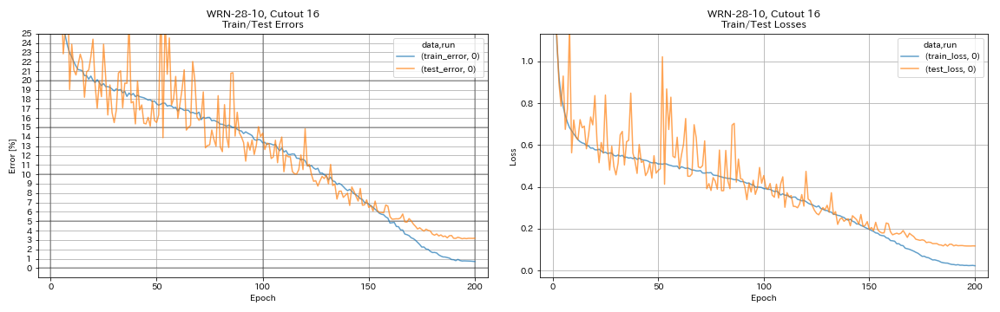

```bash
python train.py --config configs/cifar/shake_shake.yaml \
    model.shake_shake.initial_channels 64 \
    train.batch_size 64 \
    train.base_lr 0.1 \
    scheduler.epochs 300 \
    train.output_dir experiments/shake_shake_26_2x64d_SSI_cutout16/exp00 \
    augmentation.use_cutout True
```

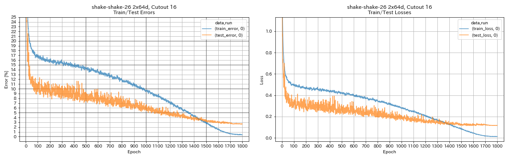


### Results using multi-GPU

| Model                       | batch size | #GPUs | Test Error (1 run) | # of Epochs | Training Time* |
|:----------------------------|-----------:|:-----:|:------------------:|------------:|---------------:|
| WRN-28-10, RICAP (beta=0.3) |     512    |   1   |        2.63        |      200    |      3h41m     |
| WRN-28-10, RICAP (beta=0.3) |     256    |   2   |        2.71        |      200    |      2h14m     |
| WRN-28-10, RICAP (beta=0.3) |     128    |   4   |        2.89        |      200    |      1h01m     |
| WRN-28-10, RICAP (beta=0.3) |      64    |   8   |        2.75        |      200    |        34m     |

#### Note

* Tesla V100 was used in these experiments.


##### Using 1 GPU

```bash
python train.py --config configs/cifar/wrn.yaml \
    train.base_lr 0.2 \
    train.batch_size 512 \
    scheduler.epochs 200 \
    scheduler.type cosine \
    train.output_dir experiments/wrn_28_10_ricap_1gpu/exp00 \
    augmentation.use_ricap True \
    augmentation.use_random_crop False
```

##### Using 2 GPUs

```bash
python -m torch.distributed.launch --nproc_per_node 2 \
    train.py --config configs/cifar/wrn.yaml \
    train.distributed True \
    train.base_lr 0.2 \
    train.batch_size 256 \
    scheduler.epochs 200 \
    scheduler.type cosine \
    train.output_dir experiments/wrn_28_10_ricap_2gpus/exp00 \
    augmentation.use_ricap True \
    augmentation.use_random_crop False
```

##### Using 4 GPUs

```bash
python -m torch.distributed.launch --nproc_per_node 4 \
    train.py --config configs/cifar/wrn.yaml \
    train.distributed True \
    train.base_lr 0.2 \
    train.batch_size 128 \
    scheduler.epochs 200 \
    scheduler.type cosine \
    train.output_dir experiments/wrn_28_10_ricap_4gpus/exp00 \
    augmentation.use_ricap True \
    augmentation.use_random_crop False
```

##### Using 8 GPUs

```bash
python -m torch.distributed.launch --nproc_per_node 8 \
    train.py --config configs/cifar/wrn.yaml \
    train.distributed True \
    train.base_lr 0.2 \
    train.batch_size 64 \
    scheduler.epochs 200 \
    scheduler.type cosine \
    train.output_dir experiments/wrn_28_10_ricap_8gpus/exp00 \
    augmentation.use_ricap True \
    augmentation.use_random_crop False
```


## Results on FashionMNIST

| Model                                          | Test Error (1 run) | # of Epochs | Training Time |
|:-----------------------------------------------|:------------------:|------------:|--------------:|
| ResNet-preact-20, widening factor 4, Cutout 12 |        4.17        |     200     |     1h32m     |
| ResNet-preact-20, widening factor 4, Cutout 14 |        4.11        |     200     |     1h32m     |
| ResNet-preact-50, Cutout 12                    |        4.45        |     200     |       57m     |
| ResNet-preact-50, Cutout 14                    |        4.38        |     200     |       57m     |
| ResNet-preact-50, widening factor 4,Cutout 12  |        4.07        |     200     |     3h37m     |
| ResNet-preact-50, widening factor 4,Cutout 14  |        4.13        |     200     |     3h39m     |
| shake-shake-26 2x32d (S-S-I), Cutout 12        |        4.08        |     400     |     3h41m     |
| shake-shake-26 2x32d (S-S-I), Cutout 14        |        4.05        |     400     |     3h39m     |
| shake-shake-26 2x96d (S-S-I), Cutout 12        |        3.72        |     400     |    13h46m     |
| shake-shake-26 2x96d (S-S-I), Cutout 14        |        3.85        |     400     |    13h39m     |
| shake-shake-26 2x96d (S-S-I), Cutout 12        |        3.65        |     800     |    26h42m     |
| shake-shake-26 2x96d (S-S-I), Cutout 14        |        3.60        |     800     |    26h42m     |

| Model                           | Test Error (median of 3 runs) | # of Epochs | Training Time |
|:--------------------------------|:-----------------------------:|------------:|--------------:|
| ResNet-preact-20                |             5.04              |     200     |       26m     |
| ResNet-preact-20, Cutout  6     |             4.84              |     200     |       26m     |
| ResNet-preact-20, Cutout  8     |             4.64              |     200     |       26m     |
| ResNet-preact-20, Cutout 10     |             4.74              |     200     |       26m     |
| ResNet-preact-20, Cutout 12     |             4.68              |     200     |       26m     |
| ResNet-preact-20, Cutout 14     |             4.64              |     200     |       26m     |
| ResNet-preact-20, Cutout 16     |             4.49              |     200     |       26m     |
| ResNet-preact-20, RandomErasing |             4.61              |     200     |       26m     |
| ResNet-preact-20, Mixup         |             4.92              |     200     |       26m     |
| ResNet-preact-20, Mixup         |             4.64              |     400     |       52m     |


### Note

* Results reported in the tables are the test errors at last epochs.
* All models are trained using cosine annealing with initial learning rate 0.2.
* Following data augmentations are applied to the training data:
    * Images are padded with 4 pixels on each side, and 28x28 patches are randomly cropped from the padded images.
    * Images are randomly flipped horizontally.
* GeForce GTX 1080 Ti was used in these experiments.


## Results on MNIST

| Model                                          | Test Error (median of 3 runs) | # of Epochs | Training Time |
|:-----------------------------------------------|:-----------------------------:|------------:|--------------:|
| ResNet-preact-20                               |             0.40              |     100     |       12m     |
| ResNet-preact-20, Cutout  6                    |             0.32              |     100     |       12m     |
| ResNet-preact-20, Cutout  8                    |             0.25              |     100     |       12m     |
| ResNet-preact-20, Cutout 10                    |             0.27              |     100     |       12m     |
| ResNet-preact-20, Cutout 12                    |             0.26              |     100     |       12m     |
| ResNet-preact-20, Cutout 14                    |             0.26              |     100     |       12m     |
| ResNet-preact-20, Cutout 16                    |             0.25              |     100     |       12m     |
| ResNet-preact-20, Mixup (alpha=1)              |             0.40              |     100     |       12m     |
| ResNet-preact-20, Mixup (alpha=0.5)            |             0.38              |     100     |       12m     |
| ResNet-preact-20, widening factor 4, Cutout 14 |             0.26              |     100     |       45m     |
| ResNet-preact-50, Cutout 14                    |             0.29              |     100     |       28m     |
| ResNet-preact-50, widening factor 4, Cutout 14 |             0.25              |     100     |     1h50m     |
| shake-shake-26 2x96d (S-S-I), Cutout 14        |             0.24              |     100     |     3h22m     |


### Note

* Results reported in the table are the test errors at last epochs.
* All models are trained using cosine annealing with initial learning rate 0.2.
* GeForce GTX 1080 Ti was used in these experiments.


## Results on Kuzushiji-MNIST

| Model                                          | Test Error (median of 3 runs) | # of Epochs | Training Time |
|:-----------------------------------------------|:-----------------------------:|------------:|--------------:|
| ResNet-preact-20, Cutout 14                    |        0.82 (best 0.67)       |     200     |       24m     |
| ResNet-preact-20, widening factor 4, Cutout 14 |        0.72 (best 0.67)       |     200     |     1h30m     |
| PyramidNet-110-270, Cutout 14                  |        0.72 (best 0.70)       |     200     |    10h05m     |
| shake-shake-26 2x96d (S-S-I), Cutout 14        |        0.66 (best 0.63)       |     200     |     6h46m     |


### Note

* Results reported in the table are the test errors at last epochs.
* All models are trained using cosine annealing with initial learning rate 0.2.
* GeForce GTX 1080 Ti was used in these experiments.


## Experiments

### Experiment on residual units, learning rate scheduling, and data augmentation

In this experiment, the effects of the following on classification accuracy are investigated:

* PyramidNet-like residual units
* Cosine annealing of learning rate
* Cutout
* Random Erasing
* Mixup
* Preactivation of shortcuts after downsampling

ResNet-preact-56 is trained on CIFAR-10 with initial learning rate 0.2 in this experiment.

#### Note

* PyramidNet paper (1610.02915) showed that removing first ReLU in residual units and adding BN after last convolutions in residual units both improve classification accuracy.
* SGDR paper (1608.03983) showed cosine annealing improves classification accuracy even without restarting.

#### Results

* PyramidNet-like units works.
    * It might be better not to preactivate shortcuts after downsampling when using PyramidNet-like units.
* Cosine annealing slightly improves accuracy.
* Cutout, RandomErasing, and Mixup all work great.
    * Mixup needs longer training.


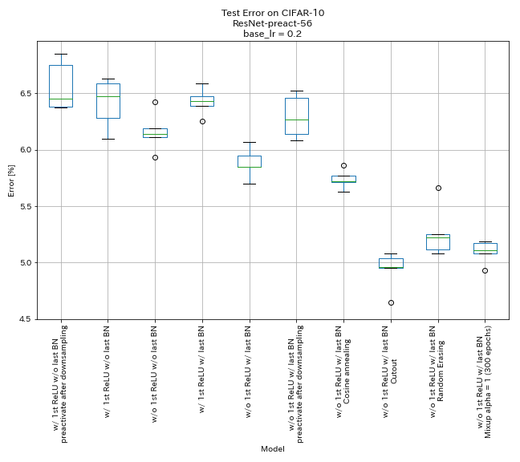

| Model                                                             | Test Error (median of 5 runs) | Training Time |
|:------------------------------------------------------------------|:-----------------------------:|--------------:|
| w/ 1st ReLU, w/o last BN, preactivate shortcut after downsampling | 6.45                          |    95 min     |
| w/ 1st ReLU, w/o last BN                                          | 6.47                          |    95 min     |
| w/o 1st ReLU, w/o last BN                                         | 6.14                          |    89 min     |
| w/ 1st ReLU, w/ last BN                                           | 6.43                          |   104 min     |
| w/o 1st ReLU, w/ last BN                                          | 5.85                          |    98 min     |
| w/o 1st ReLU, w/ last BN, preactivate shortcut after downsampling | 6.27                          |    98 min     |
| w/o 1st ReLU, w/ last BN, Cosine annealing                        | 5.72                          |    98 min     |
| w/o 1st ReLU, w/ last BN, Cutout                                  | 4.96                          |    98 min     |
| w/o 1st ReLU, w/ last BN, RandomErasing                           | 5.22                          |    98 min     |
| w/o 1st ReLU, w/ last BN, Mixup (300 epochs)                      | 5.11                          |   191 min     |


##### preactivate shortcut after downsampling

```bash
python train.py --config configs/cifar/resnet_preact.yaml \
    train.base_lr 0.2 \
    model.resnet_preact.depth 56 \
    model.resnet_preact.preact_stage '[True, True, True]' \
    model.resnet_preact.remove_first_relu False \
    model.resnet_preact.add_last_bn False \
    train.output_dir experiments/resnet_preact_after_downsampling/exp00
```

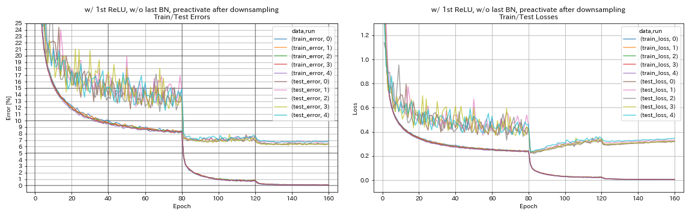


##### w/ 1st ReLU, w/o last BN

```bash
python train.py --config configs/cifar/resnet_preact.yaml \
    train.base_lr 0.2 \
    model.resnet_preact.depth 56 \
    model.resnet_preact.preact_stage '[True, False, False]' \
    model.resnet_preact.remove_first_relu False \
    model.resnet_preact.add_last_bn False \
    train.output_dir experiments/resnet_preact_w_relu_wo_bn/exp00
```

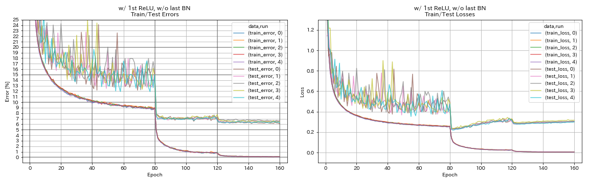

##### w/o 1st ReLU, w/o last BN

```bash
python train.py --config configs/cifar/resnet_preact.yaml \
    train.base_lr 0.2 \
    model.resnet_preact.depth 56 \
    model.resnet_preact.preact_stage '[True, False, False]' \
    model.resnet_preact.remove_first_relu True \
    model.resnet_preact.add_last_bn False \
    train.output_dir experiments/resnet_preact_wo_relu_wo_bn/exp00
```

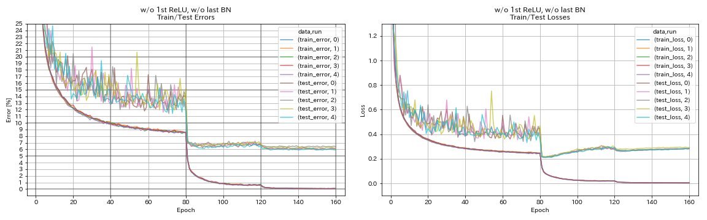

##### w/ 1st ReLU, w/ last BN

```bash
python train.py --config configs/cifar/resnet_preact.yaml \
    train.base_lr 0.2 \
    model.resnet_preact.depth 56 \
    model.resnet_preact.preact_stage '[True, False, False]' \
    model.resnet_preact.remove_first_relu False \
    model.resnet_preact.add_last_bn True \
    train.output_dir experiments/resnet_preact_w_relu_w_bn/exp00
```

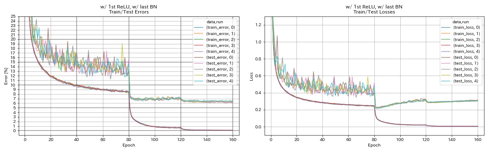

##### w/o 1st ReLU, w/ last BN

```bash
python train.py --config configs/cifar/resnet_preact.yaml \
    train.base_lr 0.2 \
    model.resnet_preact.depth 56 \
    model.resnet_preact.preact_stage '[True, False, False]' \
    model.resnet_preact.remove_first_relu True \
    model.resnet_preact.add_last_bn True \
    train.output_dir experiments/resnet_preact_wo_relu_w_bn/exp00
```

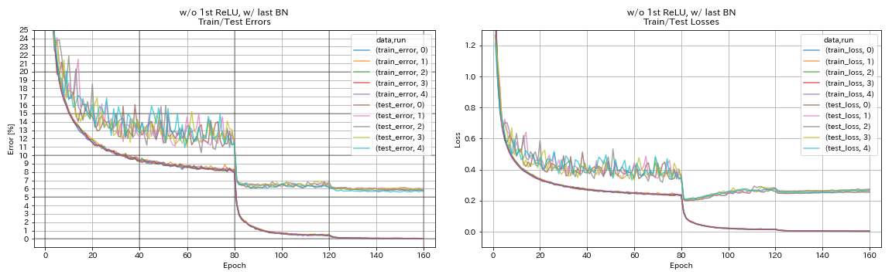

##### w/o 1st ReLU, w/ last BN, preactivate shortcut after downsampling

```bash
python train.py --config configs/cifar/resnet_preact.yaml \
    train.base_lr 0.2 \
    model.resnet_preact.depth 56 \
    model.resnet_preact.preact_stage '[True, True, True]' \
    model.resnet_preact.remove_first_relu True \
    model.resnet_preact.add_last_bn True \
    train.output_dir experiments/resnet_preact_after_downsampling_wo_relu_w_bn/exp00
```

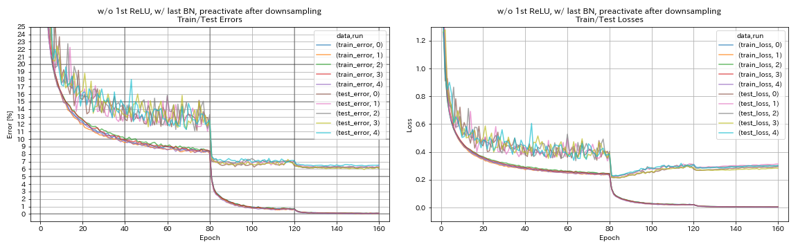

##### w/o 1st ReLU, w/ last BN, cosine annealing

```bash
python train.py --config configs/cifar/resnet_preact.yaml \
    train.base_lr 0.2 \
    model.resnet_preact.depth 56 \
    model.resnet_preact.preact_stage '[True, False, False]' \
    model.resnet_preact.remove_first_relu True \
    model.resnet_preact.add_last_bn True \
    scheduler.type cosine \
    train.output_dir experiments/resnet_preact_wo_relu_w_bn_cosine/exp00
```

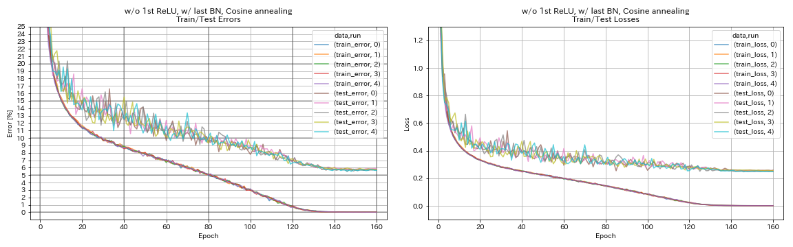

##### w/o 1st ReLU, w/ last BN, Cutout

```bash
python train.py --config configs/cifar/resnet_preact.yaml \
    train.base_lr 0.2 \
    model.resnet_preact.depth 56 \
    model.resnet_preact.preact_stage '[True, False, False]' \
    model.resnet_preact.remove_first_relu True \
    model.resnet_preact.add_last_bn True \
    augmentation.use_cutout True \
    train.output_dir experiments/resnet_preact_wo_relu_w_bn_cutout/exp00
```

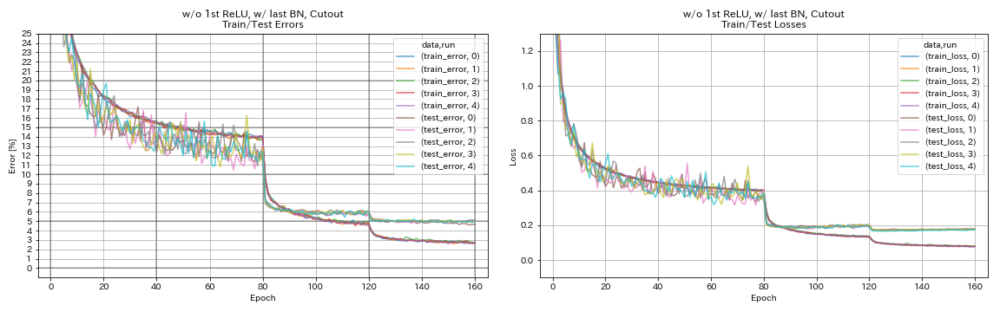

##### w/o 1st ReLU, w/ last BN, RandomErasing

```bash
python train.py --config configs/cifar/resnet_preact.yaml \
    train.base_lr 0.2 \
    model.resnet_preact.depth 56 \
    model.resnet_preact.preact_stage '[True, False, False]' \
    model.resnet_preact.remove_first_relu True \
    model.resnet_preact.add_last_bn True \
    augmentation.use_random_erasing True \
    train.output_dir experiments/resnet_preact_wo_relu_w_bn_random_erasing/exp00
```

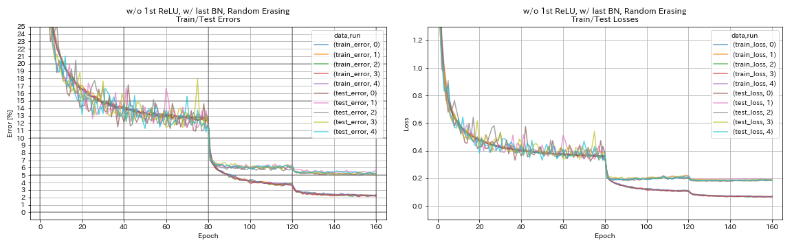

##### w/o 1st ReLU, w/ last BN, Mixup

```bash
python train.py --config configs/cifar/resnet_preact.yaml \
    train.base_lr 0.2 \
    model.resnet_preact.depth 56 \
    model.resnet_preact.preact_stage '[True, False, False]' \
    model.resnet_preact.remove_first_relu True \
    model.resnet_preact.add_last_bn True \
    augmentation.use_mixup True \
    train.output_dir experiments/resnet_preact_wo_relu_w_bn_mixup/exp00
```

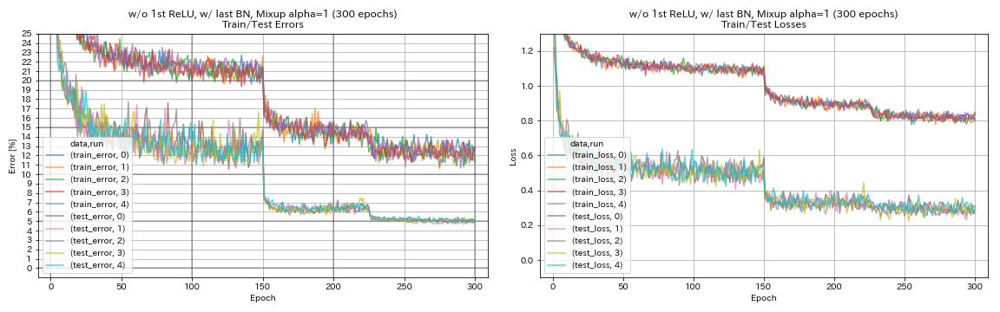


### Experiments on label smoothing, Mixup, RICAP, and Dual-Cutout
#### Results on CIFAR-10

| Model                                              | Test Error (median of 3 runs) | # of Epochs | Training Time |
|:---------------------------------------------------|:-----------------------------:|------------:|--------------:|
| ResNet-preact-20                                   |             7.60              |     200     |       24m     |
| ResNet-preact-20, label smoothing (epsilon=0.001)  |             7.51              |     200     |       25m     |
| ResNet-preact-20, label smoothing (epsilon=0.01)   |             7.21              |     200     |       25m     |
| ResNet-preact-20, label smoothing (epsilon=0.1)    |             7.57              |     200     |       25m     |
| ResNet-preact-20, mixup (alpha=1)                  |             7.24              |     200     |       26m     |
| ResNet-preact-20, RICAP (beta=0.3), w/ random crop |             6.88              |     200     |       28m     |
| ResNet-preact-20, RICAP (beta=0.3)                 |             6.77              |     200     |       28m     |
| ResNet-preact-20, Dual-Cutout 16 (alpha=0.1)       |             6.24              |     200     |       45m     |
| ResNet-preact-20                                   |             7.05              |     400     |       49m     |
| ResNet-preact-20, label smoothing (epsilon=0.001)  |             7.20              |     400     |       49m     |
| ResNet-preact-20, label smoothing (epsilon=0.01)   |             6.97              |     400     |       49m     |
| ResNet-preact-20, label smoothing (epsilon=0.1)    |             7.16              |     400     |       49m     |
| ResNet-preact-20, mixup (alpha=1)                  |             6.66              |     400     |       51m     |
| ResNet-preact-20, RICAP (beta=0.3), w/ random crop |             6.30              |     400     |       56m     |
| ResNet-preact-20, RICAP (beta=0.3)                 |             6.19              |     400     |       56m     |
| ResNet-preact-20, Dual-Cutout 16 (alpha=0.1)       |             5.55              |     400     |     1h36m     |

#### Note

* Results reported in the table are the test errors at last epochs.
* All models are trained using cosine annealing with initial learning rate 0.2.
* GeForce GTX 1080 Ti was used in these experiments.


### Experiments on batch size and learning rate

* Following experiments are done on CIFAR-10 dataset using GeForce 1080 Ti.
* Results reported in the table are the test errors at last epochs.

#### Linear scaling rule for learning rate

| Model            | batch size | initial lr | lr schedule | # of Epochs | Test Error (1 run) | Training Time |
|:----------------:|-----------:|:-----------|:-----------:|------------:|:------------------:|--------------:|
| ResNet-preact-20 |    4096    |   3.2      |    cosine   |     200     |        10.57       |       22m     |
| ResNet-preact-20 |    2048    |   1.6      |    cosine   |     200     |         8.87       |       21m     |
| ResNet-preact-20 |    1024    |   0.8      |    cosine   |     200     |         8.40       |       21m     |
| ResNet-preact-20 |     512    |   0.4      |    cosine   |     200     |         8.22       |       20m     |
| ResNet-preact-20 |     256    |   0.2      |    cosine   |     200     |         8.61       |       22m     |
| ResNet-preact-20 |     128    |   0.1      |    cosine   |     200     |         8.09       |       24m     |
| ResNet-preact-20 |      64    |   0.05     |    cosine   |     200     |         8.22       |       28m     |
| ResNet-preact-20 |      32    |   0.025    |    cosine   |     200     |         8.00       |       43m     |
| ResNet-preact-20 |      16    |   0.0125   |    cosine   |     200     |         7.75       |     1h17m     |
| ResNet-preact-20 |       8    |   0.006125 |    cosine   |     200     |         7.70       |     2h32m     |

| Model            | batch size | initial lr | lr schedule | # of Epochs | Test Error (1 run) | Training Time |
|:----------------:|-----------:|:-----------|:-----------:|------------:|:------------------:|--------------:|
| ResNet-preact-20 |    4096    |   3.2      |  multistep  |     200     |        28.97       |       22m     |
| ResNet-preact-20 |    2048    |   1.6      |  multistep  |     200     |         9.07       |       21m     |
| ResNet-preact-20 |    1024    |   0.8      |  multistep  |     200     |         8.62       |       21m     |
| ResNet-preact-20 |     512    |   0.4      |  multistep  |     200     |         8.23       |       20m     |
| ResNet-preact-20 |     256    |   0.2      |  multistep  |     200     |         8.40       |       21m     |
| ResNet-preact-20 |     128    |   0.1      |  multistep  |     200     |         8.28       |       24m     |
| ResNet-preact-20 |      64    |   0.05     |  multistep  |     200     |         8.13       |       28m     |
| ResNet-preact-20 |      32    |   0.025    |  multistep  |     200     |         7.58       |       43m     |
| ResNet-preact-20 |      16    |   0.0125   |  multistep  |     200     |         7.93       |     1h18m     |
| ResNet-preact-20 |       8    |   0.006125 |  multistep  |     200     |         8.31       |     2h34m     |

#### Linear scaling + longer training

| Model            | batch size | initial lr | lr schedule | # of Epochs | Test Error (1 run) | Training Time |
|:----------------:|-----------:|:-----------|:-----------:|------------:|:------------------:|--------------:|
| ResNet-preact-20 |    4096    |   3.2      |    cosine   |     400     |         8.97       |       44m     |
| ResNet-preact-20 |    2048    |   1.6      |    cosine   |     400     |         7.85       |       43m     |
| ResNet-preact-20 |    1024    |   0.8      |    cosine   |     400     |         7.20       |       42m     |
| ResNet-preact-20 |     512    |   0.4      |    cosine   |     400     |         7.83       |       40m     |
| ResNet-preact-20 |     256    |   0.2      |    cosine   |     400     |         7.65       |       42m     |
| ResNet-preact-20 |     128    |   0.1      |    cosine   |     400     |         7.09       |       47m     |
| ResNet-preact-20 |      64    |   0.05     |    cosine   |     400     |         7.17       |       44m     |
| ResNet-preact-20 |      32    |   0.025    |    cosine   |     400     |         7.24       |     2h11m     |
| ResNet-preact-20 |      16    |   0.0125   |    cosine   |     400     |         7.26       |     4h10m     |
| ResNet-preact-20 |       8    |   0.006125 |    cosine   |     400     |         7.02      |      7h53m    |

| Model            | batch size | initial lr | lr schedule | # of Epochs | Test Error (1 run) | Training Time |
|:----------------:|-----------:|:-----------|:-----------:|------------:|:------------------:|--------------:|
| ResNet-preact-20 |    4096    |   3.2      |    cosine   |     800     |         8.14       |     1h29m     |
| ResNet-preact-20 |    2048    |   1.6      |    cosine   |     800     |         7.74       |     1h23m     |
| ResNet-preact-20 |    1024    |   0.8      |    cosine   |     800     |         7.15       |     1h31m     |
| ResNet-preact-20 |     512    |   0.4      |    cosine   |     800     |         7.27       |     1h25m     |
| ResNet-preact-20 |     256    |   0.2      |    cosine   |     800     |         7.22       |     1h26m     |
| ResNet-preact-20 |     128    |   0.1      |    cosine   |     800     |         6.68       |     1h35m     |
| ResNet-preact-20 |      64    |   0.05     |    cosine   |     800     |         7.18       |     2h20m     |
| ResNet-preact-20 |      32    |   0.025    |    cosine   |     800     |         7.03       |     4h16m     |
| ResNet-preact-20 |      16    |   0.0125   |    cosine   |     800     |         6.78       |     8h37m     |
| ResNet-preact-20 |       8    |   0.006125 |    cosine   |     800     |         6.89       |    16h47m     |

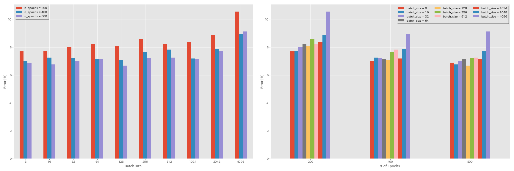

#### Effect of initial learning rate

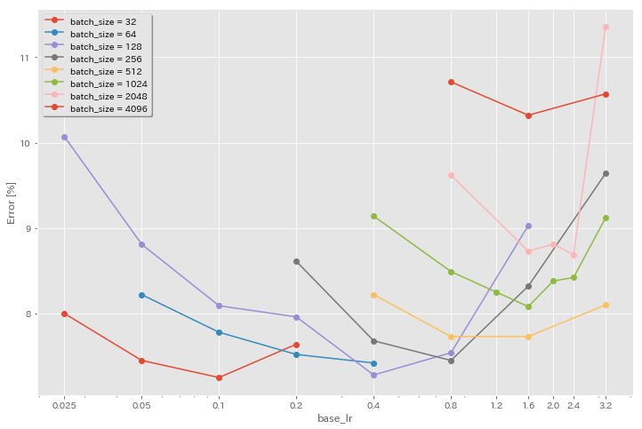

| Model            | batch size | initial lr | lr schedule | # of Epochs | Test Error (1 run) | Training Time |
|:----------------:|-----------:|:-----------|:-----------:|------------:|:------------------:|--------------:|
| ResNet-preact-20 |    4096    |   3.2      |    cosine   |     200     |        10.57       |       22m     |
| ResNet-preact-20 |    4096    |   1.6      |    cosine   |     200     |        10.32       |       22m     |
| ResNet-preact-20 |    4096    |   0.8      |    cosine   |     200     |        10.71       |       22m     |

| Model            | batch size | initial lr | lr schedule | # of Epochs | Test Error (1 run) | Training Time |
|:----------------:|-----------:|:-----------|:-----------:|------------:|:------------------:|--------------:|
| ResNet-preact-20 |    2048    |   3.2      |    cosine   |     200     |        11.34       |       21m     |
| ResNet-preact-20 |    2048    |   2.4      |    cosine   |     200     |         8.69       |       21m     |
| ResNet-preact-20 |    2048    |   2.0      |    cosine   |     200     |         8.81       |       21m     |
| ResNet-preact-20 |    2048    |   1.6      |    cosine   |     200     |         8.73       |       22m     |
| ResNet-preact-20 |    2048    |   0.8      |    cosine   |     200     |         9.62       |       21m     |

| Model            | batch size | initial lr | lr schedule | # of Epochs | Test Error (1 run) | Training Time |
|:----------------:|-----------:|:-----------|:-----------:|------------:|:------------------:|--------------:|
| ResNet-preact-20 |    1024    |   3.2      |    cosine   |     200     |         9.12       |       21m     |
| ResNet-preact-20 |    1024    |   2.4      |    cosine   |     200     |         8.42       |       22m     |
| ResNet-preact-20 |    1024    |   2.0      |    cosine   |     200     |         8.38       |       22m     |
| ResNet-preact-20 |    1024    |   1.6      |    cosine   |     200     |         8.07       |       22m     |
| ResNet-preact-20 |    1024    |   1.2      |    cosine   |     200     |         8.25       |       21m     |
| ResNet-preact-20 |    1024    |   0.8      |    cosine   |     200     |         8.08       |       22m     |
| ResNet-preact-20 |    1024    |   0.4      |    cosine   |     200     |         8.49       |       22m     |

| Model            | batch size | initial lr | lr schedule | # of Epochs | Test Error (1 run) | Training Time |
|:----------------:|-----------:|:-----------|:-----------:|------------:|:------------------:|--------------:|
| ResNet-preact-20 |     512    |   3.2      |    cosine   |     200     |         8.51       |       21m     |
| ResNet-preact-20 |     512    |   1.6      |    cosine   |     200     |         7.73       |       20m     |
| ResNet-preact-20 |     512    |   0.8      |    cosine   |     200     |         7.73       |       21m     |
| ResNet-preact-20 |     512    |   0.4      |    cosine   |     200     |         8.22       |       20m     |

| Model            | batch size | initial lr | lr schedule | # of Epochs | Test Error (1 run) | Training Time |
|:----------------:|-----------:|:-----------|:-----------:|------------:|:------------------:|--------------:|
| ResNet-preact-20 |     256    |   3.2      |    cosine   |     200     |         9.64       |       22m     |
| ResNet-preact-20 |     256    |   1.6      |    cosine   |     200     |         8.32       |       22m     |
| ResNet-preact-20 |     256    |   0.8      |    cosine   |     200     |         7.45       |       21m     |
| ResNet-preact-20 |     256    |   0.4      |    cosine   |     200     |         7.68       |       22m     |
| ResNet-preact-20 |     256    |   0.2      |    cosine   |     200     |         8.61       |       22m     |

| Model            | batch size | initial lr | lr schedule | # of Epochs | Test Error (1 run) | Training Time |
|:----------------:|-----------:|:-----------|:-----------:|------------:|:------------------:|--------------:|
| ResNet-preact-20 |     128    |   1.6      |    cosine   |     200     |         9.03       |       24m     |
| ResNet-preact-20 |     128    |   0.8      |    cosine   |     200     |         7.54       |       24m     |
| ResNet-preact-20 |     128    |   0.4      |    cosine   |     200     |         7.28       |       24m     |
| ResNet-preact-20 |     128    |   0.2      |    cosine   |     200     |         7.96       |       24m     |
| ResNet-preact-20 |     128    |   0.1      |    cosine   |     200     |         8.09       |       24m     |
| ResNet-preact-20 |     128    |   0.05     |    cosine   |     200     |         8.81       |       24m     |
| ResNet-preact-20 |     128    |   0.025    |    cosine   |     200     |        10.07       |       24m     |

| Model            | batch size | initial lr | lr schedule | # of Epochs | Test Error (1 run) | Training Time |
|:----------------:|-----------:|:-----------|:-----------:|------------:|:------------------:|--------------:|
| ResNet-preact-20 |      64    |   0.4      |    cosine   |     200     |         7.42       |       35m     |
| ResNet-preact-20 |      64    |   0.2      |    cosine   |     200     |         7.52       |       36m     |
| ResNet-preact-20 |      64    |   0.1      |    cosine   |     200     |         7.78       |       37m     |
| ResNet-preact-20 |      64    |   0.05     |    cosine   |     200     |         8.22       |       28m     |

| Model            | batch size | initial lr | lr schedule | # of Epochs | Test Error (1 run) | Training Time |
|:----------------:|-----------:|:-----------|:-----------:|------------:|:------------------:|--------------:|
| ResNet-preact-20 |      32    |   0.2      |    cosine   |     200     |         7.64       |     1h05m     |
| ResNet-preact-20 |      32    |   0.1      |    cosine   |     200     |         7.25       |     1h08m     |
| ResNet-preact-20 |      32    |   0.05     |    cosine   |     200     |         7.45       |     1h07m     |
| ResNet-preact-20 |      32    |   0.025    |    cosine   |     200     |         8.00       |       43m     |

#### Good learning rate + longer training

| Model            | batch size | initial lr | lr schedule | # of Epochs | Test Error (1 run) | Training Time |
|:----------------:|-----------:|:-----------|:-----------:|------------:|:------------------:|--------------:|
| ResNet-preact-20 |    4096    |   1.6      |    cosine   |     200     |        10.32       |       22m     |
| ResNet-preact-20 |    2048    |   1.6      |    cosine   |     200     |         8.73       |       22m     |
| ResNet-preact-20 |    1024    |   1.6      |    cosine   |     200     |         8.07       |       22m     |
| ResNet-preact-20 |    1024    |   0.8      |    cosine   |     200     |         8.08       |       22m     |
| ResNet-preact-20 |     512    |   1.6      |    cosine   |     200     |         7.73       |       20m     |
| ResNet-preact-20 |     512    |   0.8      |    cosine   |     200     |         7.73       |       21m     |
| ResNet-preact-20 |     256    |   0.8      |    cosine   |     200     |         7.45       |       21m     |
| ResNet-preact-20 |     128    |   0.4      |    cosine   |     200     |         7.28       |       24m     |
| ResNet-preact-20 |     128    |   0.2      |    cosine   |     200     |         7.96       |       24m     |
| ResNet-preact-20 |     128    |   0.1      |    cosine   |     200     |         8.09       |       24m     |

| Model            | batch size | initial lr | lr schedule | # of Epochs | Test Error (1 run) | Training Time |
|:----------------:|-----------:|:-----------|:-----------:|------------:|:------------------:|--------------:|
| ResNet-preact-20 |    4096    |   1.6      |    cosine   |     800     |         8.36       |     1h33m     |
| ResNet-preact-20 |    2048    |   1.6      |    cosine   |     800     |         7.53       |     1h27m     |
| ResNet-preact-20 |    1024    |   1.6      |    cosine   |     800     |         7.30       |     1h30m     |
| ResNet-preact-20 |    1024    |   0.8      |    cosine   |     800     |         7.42       |     1h30m     |
| ResNet-preact-20 |     512    |   1.6      |    cosine   |     800     |         6.69       |     1h26m     |
| ResNet-preact-20 |     512    |   0.8      |    cosine   |     800     |         6.77       |     1h26m     |
| ResNet-preact-20 |     256    |   0.8      |    cosine   |     800     |         6.84       |     1h28m     |
| ResNet-preact-20 |     128    |   0.4      |    cosine   |     800     |         6.86       |     1h35m     |
| ResNet-preact-20 |     128    |   0.2      |    cosine   |     800     |         7.05       |     1h38m     |
| ResNet-preact-20 |     128    |   0.1      |    cosine   |     800     |         6.68       |     1h35m     |

| Model            | batch size | initial lr | lr schedule | # of Epochs | Test Error (1 run) | Training Time |
|:----------------:|-----------:|:-----------|:-----------:|------------:|:------------------:|--------------:|
| ResNet-preact-20 |    4096    |   1.6      |    cosine   |    1600     |         8.25       |     3h10m     |
| ResNet-preact-20 |    2048    |   1.6      |    cosine   |    1600     |         7.34       |     2h50m     |
| ResNet-preact-20 |    1024    |   1.6      |    cosine   |    1600     |         6.94       |     2h52m     |
| ResNet-preact-20 |     512    |   1.6      |    cosine   |    1600     |         6.99       |     2h44m     |
| ResNet-preact-20 |     256    |   0.8      |    cosine   |    1600     |         6.95       |     2h50m     |
| ResNet-preact-20 |     128    |   0.4      |    cosine   |    1600     |         6.64       |     3h09m     |

| Model            | batch size | initial lr | lr schedule | # of Epochs | Test Error (1 run) | Training Time |
|:----------------:|-----------:|:-----------|:-----------:|------------:|:------------------:|--------------:|
| ResNet-preact-20 |    4096    |   1.6      |    cosine   |    3200     |         9.52       |     6h15m     |
| ResNet-preact-20 |    2048    |   1.6      |    cosine   |    3200     |         6.92       |     5h42m     |
| ResNet-preact-20 |    1024    |   1.6      |    cosine   |    3200     |         6.96       |     5h43m     |

| Model            | batch size | initial lr | lr schedule | # of Epochs | Test Error (1 run) | Training Time |
|:----------------:|-----------:|:-----------|:-----------:|------------:|:------------------:|--------------:|
| ResNet-preact-20 |    2048    |   1.6      |    cosine   |    6400     |         7.45       |    11h44m     |

#### LARS

* In the original papers (1708.03888, 1801.03137), they used polynomial decay learning rate scheduling, but cosine annealing is used in these experiments.
* In this implementation, LARS coefficient is not used, so learning rate should be adjusted accordingly.

```bash
python train.py --config configs/cifar/resnet_preact.yaml \
    model.resnet_preact.depth 20 \
    train.optimizer lars \
    train.base_lr 0.02 \
    train.batch_size 4096 \
    scheduler.type cosine \
    train.output_dir experiments/resnet_preact_lars/exp00
```

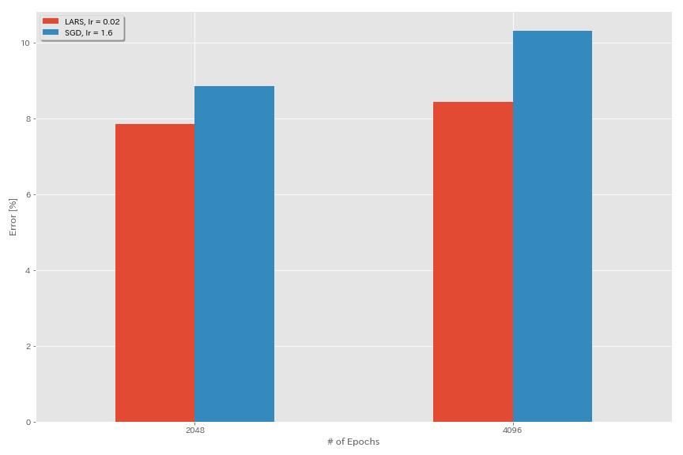

| Model            | optimizer | batch size | initial lr | lr schedule | # of Epochs | Test Error (median of 3 runs) | Training Time |
|:----------------:|:---------:|-----------:|:-----------|:-----------:|------------:|:-----------------------------:|--------------:|
| ResNet-preact-20 |    SGD    |    4096    |   3.2      |    cosine   |     200     |             10.57 (1 run)     |       22m     |
| ResNet-preact-20 |    SGD    |    4096    |   1.6      |    cosine   |     200     |             10.20             |       22m     |
| ResNet-preact-20 |    SGD    |    4096    |   0.8      |    cosine   |     200     |             10.71 (1 run)     |       22m     |
| ResNet-preact-20 |    LARS   |    4096    |   0.04     |    cosine   |     200     |              9.58             |       22m     |
| ResNet-preact-20 |    LARS   |    4096    |   0.03     |    cosine   |     200     |              8.46             |       22m     |
| ResNet-preact-20 |    LARS   |    4096    |   0.02     |    cosine   |     200     |              8.21             |       22m     |
| ResNet-preact-20 |    LARS   |    4096    |   0.015    |    cosine   |     200     |              8.47             |       22m     |
| ResNet-preact-20 |    LARS   |    4096    |   0.01     |    cosine   |     200     |              9.33             |       22m     |
| ResNet-preact-20 |    LARS   |    4096    |   0.005    |    cosine   |     200     |             14.31             |       22m     |

| Model            | optimizer | batch size | initial lr | lr schedule | # of Epochs | Test Error (median of 3 runs) | Training Time |
|:----------------:|:---------:|-----------:|:-----------|:-----------:|------------:|:-----------------------------:|--------------:|
| ResNet-preact-20 |    SGD    |    2048    |   3.2      |    cosine   |     200     |             11.34 (1 run)     |       21m     |
| ResNet-preact-20 |    SGD    |    2048    |   2.4      |    cosine   |     200     |              8.69 (1 run)     |       21m     |
| ResNet-preact-20 |    SGD    |    2048    |   2.0      |    cosine   |     200     |              8.81 (1 run)     |       21m     |
| ResNet-preact-20 |    SGD    |    2048    |   1.6      |    cosine   |     200     |              8.73 (1 run)     |       22m     |
| ResNet-preact-20 |    SGD    |    2048    |   0.8      |    cosine   |     200     |              9.62 (1 run)     |       21m     |
| ResNet-preact-20 |    LARS   |    2048    |   0.04     |    cosine   |     200     |             11.58             |       21m     |
| ResNet-preact-20 |    LARS   |    2048    |   0.02     |    cosine   |     200     |              8.05             |       22m     |
| ResNet-preact-20 |    LARS   |    2048    |   0.01     |    cosine   |     200     |              8.07             |       22m     |
| ResNet-preact-20 |    LARS   |    2048    |   0.005    |    cosine   |     200     |              9.65             |       22m     |

| Model            | optimizer | batch size | initial lr | lr schedule | # of Epochs | Test Error (median of 3 runs) | Training Time |
|:----------------:|:---------:|-----------:|:-----------|:-----------:|------------:|:-----------------------------:|--------------:|
| ResNet-preact-20 |    SGD    |    1024    |   3.2      |    cosine   |     200     |              9.12 (1 run)     |       21m     |
| ResNet-preact-20 |    SGD    |    1024    |   2.4      |    cosine   |     200     |              8.42 (1 run)     |       22m     |
| ResNet-preact-20 |    SGD    |    1024    |   2.0      |    cosine   |     200     |              8.38 (1 run)     |       22m     |
| ResNet-preact-20 |    SGD    |    1024    |   1.6      |    cosine   |     200     |              8.07 (1 run)     |       22m     |
| ResNet-preact-20 |    SGD    |    1024    |   1.2      |    cosine   |     200     |              8.25 (1 run)     |       21m     |
| ResNet-preact-20 |    SGD    |    1024    |   0.8      |    cosine   |     200     |              8.08 (1 run)     |       22m     |
| ResNet-preact-20 |    SGD    |    1024    |   0.4      |    cosine   |     200     |              8.49 (1 run)     |       22m     |
| ResNet-preact-20 |    LARS   |    1024    |   0.02     |    cosine   |     200     |              9.30             |       22m     |
| ResNet-preact-20 |    LARS   |    1024    |   0.01     |    cosine   |     200     |              7.68             |       22m     |
| ResNet-preact-20 |    LARS   |    1024    |   0.005    |    cosine   |     200     |              8.88             |       23m     |

| Model            | optimizer | batch size | initial lr | lr schedule | # of Epochs | Test Error (median of 3 runs) | Training Time |
|:----------------:|:---------:|-----------:|:-----------|:-----------:|------------:|:-----------------------------:|--------------:|
| ResNet-preact-20 |    SGD    |     512    |   3.2      |    cosine   |     200     |              8.51 (1 run)     |       21m     |
| ResNet-preact-20 |    SGD    |     512    |   1.6      |    cosine   |     200     |              7.73 (1 run)     |       20m     |
| ResNet-preact-20 |    SGD    |     512    |   0.8      |    cosine   |     200     |              7.73 (1 run)     |       21m     |
| ResNet-preact-20 |    SGD    |     512    |   0.4      |    cosine   |     200     |              8.22 (1 run)     |       20m     |
| ResNet-preact-20 |    LARS   |     512    |   0.015    |    cosine   |     200     |              9.84             |       23m     |
| ResNet-preact-20 |    LARS   |     512    |   0.01     |    cosine   |     200     |              8.05             |       23m     |
| ResNet-preact-20 |    LARS   |     512    |   0.0075   |    cosine   |     200     |              7.58             |       23m     |
| ResNet-preact-20 |    LARS   |     512    |   0.005    |    cosine   |     200     |              7.96             |       23m     |
| ResNet-preact-20 |    LARS   |     512    |   0.0025   |    cosine   |     200     |              8.83             |       23m     |

| Model            | optimizer | batch size | initial lr | lr schedule | # of Epochs | Test Error (median of 3 runs) | Training Time |
|:----------------:|:---------:|-----------:|:-----------|:-----------:|------------:|:-----------------------------:|--------------:|
| ResNet-preact-20 |    SGD    |     256    |   3.2      |    cosine   |     200     |              9.64 (1 run)     |       22m     |
| ResNet-preact-20 |    SGD    |     256    |   1.6      |    cosine   |     200     |              8.32 (1 run)     |       22m     |
| ResNet-preact-20 |    SGD    |     256    |   0.8      |    cosine   |     200     |              7.45 (1 run)     |       21m     |
| ResNet-preact-20 |    SGD    |     256    |   0.4      |    cosine   |     200     |              7.68 (1 run)     |       22m     |
| ResNet-preact-20 |    SGD    |     256    |   0.2      |    cosine   |     200     |              8.61 (1 run)     |       22m     |
| ResNet-preact-20 |    LARS   |     256    |   0.01     |    cosine   |     200     |              8.95             |       27m     |
| ResNet-preact-20 |    LARS   |     256    |   0.005    |    cosine   |     200     |              7.75             |       28m     |
| ResNet-preact-20 |    LARS   |     256    |   0.0025   |    cosine   |     200     |              8.21             |       28m     |

| Model            | optimizer | batch size | initial lr | lr schedule | # of Epochs | Test Error (median of 3 runs) | Training Time |
|:----------------:|:---------:|-----------:|:-----------|:-----------:|------------:|:-----------------------------:|--------------:|
| ResNet-preact-20 |    SGD    |     128    |   1.6      |    cosine   |     200     |              9.03 (1 run)     |       24m     |
| ResNet-preact-20 |    SGD    |     128    |   0.8      |    cosine   |     200     |              7.54 (1 run)     |       24m     |
| ResNet-preact-20 |    SGD    |     128    |   0.4      |    cosine   |     200     |              7.28 (1 run)     |       24m     |
| ResNet-preact-20 |    SGD    |     128    |   0.2      |    cosine   |     200     |              7.96 (1 run)     |       24m     |
| ResNet-preact-20 |    LARS   |     128    |   0.005    |    cosine   |     200     |              7.96             |       37m     |
| ResNet-preact-20 |    LARS   |     128    |   0.0025   |    cosine   |     200     |              7.98             |       37m     |
| ResNet-preact-20 |    LARS   |     128    |   0.00125  |    cosine   |     200     |              9.21             |       37m     |

| Model            | optimizer | batch size | initial lr | lr schedule | # of Epochs | Test Error (median of 3 runs) | Training Time |
|:----------------:|:---------:|-----------:|:-----------|:-----------:|------------:|:-----------------------------:|--------------:|
| ResNet-preact-20 |    SGD    |    4096    |   1.6      |    cosine   |     200     |             10.20             |       22m     |
| ResNet-preact-20 |    SGD    |    4096    |   1.6      |    cosine   |     800     |              8.36 (1 run)     |     1h33m     |
| ResNet-preact-20 |    SGD    |    4096    |   1.6      |    cosine   |    1600     |              8.25 (1 run)     |     3h10m     |
| ResNet-preact-20 |    LARS   |    4096    |   0.02     |    cosine   |     200     |              8.21             |       22m     |
| ResNet-preact-20 |    LARS   |    4096    |   0.02     |    cosine   |     400     |              7.53             |       44m     |
| ResNet-preact-20 |    LARS   |    4096    |   0.02     |    cosine   |     800     |              7.48             |     1h29m     |
| ResNet-preact-20 |    LARS   |    4096    |   0.02     |    cosine   |    1600     |              7.37 (1 run)     |     2h58m     |

#### Ghost BN

```bash
python train.py --config configs/cifar/resnet_preact.yaml \
    model.resnet_preact.depth 20 \
    train.base_lr 1.5 \
    train.batch_size 4096 \
    train.subdivision 32 \
    scheduler.type cosine \
    train.output_dir experiments/resnet_preact_ghost_batch/exp00
```

| Model            | batch size | ghost batch size | initial lr | lr schedule | # of Epochs | Test Error (1 run) | Training Time |
|:----------------:|-----------:|:----------------:|:-----------|:-----------:|------------:|:------------------:|--------------:|
| ResNet-preact-20 |    8192    |       N/A        |   1.6      |    cosine   |     200     |        12.35       |       25m*    |
| ResNet-preact-20 |    4096    |       N/A        |   1.6      |    cosine   |     200     |        10.32       |       22m     |
| ResNet-preact-20 |    2048    |       N/A        |   1.6      |    cosine   |     200     |         8.73       |       22m     |
| ResNet-preact-20 |    1024    |       N/A        |   1.6      |    cosine   |     200     |         8.07       |       22m     |
| ResNet-preact-20 |     128    |       N/A        |   0.4      |    cosine   |     200     |         7.28       |       24m     |

| Model            | batch size | ghost batch size | initial lr | lr schedule | # of Epochs | Test Error (1 run) | Training Time |
|:----------------:|-----------:|:----------------:|:-----------|:-----------:|------------:|:------------------:|--------------:|
| ResNet-preact-20 |    8192    |       128        |   1.6      |    cosine   |     200     |        11.51       |       27m     |
| ResNet-preact-20 |    4096    |       128        |   1.6      |    cosine   |     200     |         9.73       |       25m     |
| ResNet-preact-20 |    2048    |       128        |   1.6      |    cosine   |     200     |         8.77       |       24m     |
| ResNet-preact-20 |    1024    |       128        |   1.6      |    cosine   |     200     |         7.82       |       22m     |

| Model            | batch size | ghost batch size | initial lr | lr schedule | # of Epochs | Test Error (1 run) | Training Time |
|:----------------:|-----------:|:----------------:|:-----------|:-----------:|------------:|:------------------:|--------------:|
| ResNet-preact-20 |    8192    |       N/A        |   1.6      |    cosine   |    1600     |                    |               |
| ResNet-preact-20 |    4096    |       N/A        |   1.6      |    cosine   |    1600     |         8.25       |     3h10m     |
| ResNet-preact-20 |    2048    |       N/A        |   1.6      |    cosine   |    1600     |         7.34       |     2h50m     |
| ResNet-preact-20 |    1024    |       N/A        |   1.6      |    cosine   |    1600     |         6.94       |     2h52m     |

| Model            | batch size | ghost batch size | initial lr | lr schedule | # of Epochs | Test Error (1 run) | Training Time |
|:----------------:|-----------:|:----------------:|:-----------|:-----------:|------------:|:------------------:|--------------:|
| ResNet-preact-20 |    8192    |       128        |   1.6      |    cosine   |    1600     |        11.83       |     3h37m     |
| ResNet-preact-20 |    4096    |       128        |   1.6      |    cosine   |    1600     |         8.95       |     3h15m     |
| ResNet-preact-20 |    2048    |       128        |   1.6      |    cosine   |    1600     |         7.23       |     3h05m     |
| ResNet-preact-20 |    1024    |       128        |   1.6      |    cosine   |    1600     |         7.08       |     2h59m     |

#### No weight decay on BN

```bash
python train.py --config configs/cifar/resnet_preact.yaml \
    model.resnet_preact.depth 20 \
    train.base_lr 1.6 \
    train.batch_size 4096 \
    train.no_weight_decay_on_bn True \
    train.weight_decay 5e-4 \
    scheduler.type cosine \
    train.output_dir experiments/resnet_preact_no_weight_decay_on_bn/exp00
```

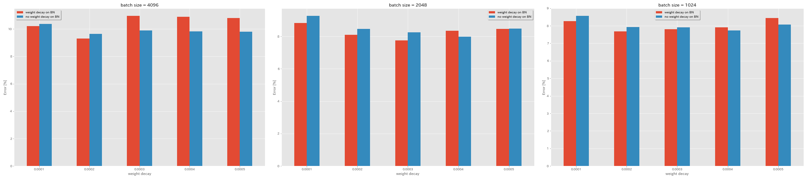

| Model            | weight decay on BN | weight decay | batch size | initial lr | lr schedule | # of Epochs | Test Error (median of 3 runs) | Training Time |
|:----------------:|:------------------:|-------------:|-----------:|:-----------|:-----------:|------------:|:-----------------------------:|--------------:|
| ResNet-preact-20 |        yes         |     5e-4     |    4096    |   1.6      |    cosine   |     200     |              10.81            |       22m     |
| ResNet-preact-20 |        yes         |     4e-4     |    4096    |   1.6      |    cosine   |     200     |              10.88            |       22m     |
| ResNet-preact-20 |        yes         |     3e-4     |    4096    |   1.6      |    cosine   |     200     |              10.96            |       22m     |
| ResNet-preact-20 |        yes         |     2e-4     |    4096    |   1.6      |    cosine   |     200     |               9.30            |       22m     |
| ResNet-preact-20 |        yes         |     1e-4     |    4096    |   1.6      |    cosine   |     200     |              10.20            |       22m     |
| ResNet-preact-20 |        no          |     5e-4     |    4096    |   1.6      |    cosine   |     200     |               8.78            |       22m     |
| ResNet-preact-20 |        no          |     4e-4     |    4096    |   1.6      |    cosine   |     200     |               9.83            |       22m     |
| ResNet-preact-20 |        no          |     3e-4     |    4096    |   1.6      |    cosine   |     200     |               9.90            |       22m     |
| ResNet-preact-20 |        no          |     2e-4     |    4096    |   1.6      |    cosine   |     200     |               9.64            |       22m     |
| ResNet-preact-20 |        no          |     1e-4     |    4096    |   1.6      |    cosine   |     200     |              10.38            |       22m     |

| Model            | weight decay on BN | weight decay | batch size | initial lr | lr schedule | # of Epochs | Test Error (median of 3 runs) | Training Time |
|:----------------:|:------------------:|-------------:|-----------:|:-----------|:-----------:|------------:|:-----------------------------:|--------------:|
| ResNet-preact-20 |        yes         |     5e-4     |    2048    |   1.6      |    cosine   |     200     |               8.46            |       20m     |
| ResNet-preact-20 |        yes         |     4e-4     |    2048    |   1.6      |    cosine   |     200     |               8.35            |       20m     |
| ResNet-preact-20 |        yes         |     3e-4     |    2048    |   1.6      |    cosine   |     200     |               7.76            |       20m     |
| ResNet-preact-20 |        yes         |     2e-4     |    2048    |   1.6      |    cosine   |     200     |               8.09            |       20m     |
| ResNet-preact-20 |        yes         |     1e-4     |    2048    |   1.6      |    cosine   |     200     |               8.83            |       20m     |
| ResNet-preact-20 |        no          |     5e-4     |    2048    |   1.6      |    cosine   |     200     |               8.49            |       20m     |
| ResNet-preact-20 |        no          |     4e-4     |    2048    |   1.6      |    cosine   |     200     |               7.98            |       20m     |
| ResNet-preact-20 |        no          |     3e-4     |    2048    |   1.6      |    cosine   |     200     |               8.26            |       20m     |
| ResNet-preact-20 |        no          |     2e-4     |    2048    |   1.6      |    cosine   |     200     |               8.47            |       20m     |
| ResNet-preact-20 |        no          |     1e-4     |    2048    |   1.6      |    cosine   |     200     |               9.27            |       20m     |

| Model            | weight decay on BN | weight decay | batch size | initial lr | lr schedule | # of Epochs | Test Error (median of 3 runs) | Training Time |
|:----------------:|:------------------:|-------------:|-----------:|:-----------|:-----------:|------------:|:-----------------------------:|--------------:|
| ResNet-preact-20 |        yes         |     5e-4     |    1024    |   1.6      |    cosine   |     200     |               8.45            |       21m     |
| ResNet-preact-20 |        yes         |     4e-4     |    1024    |   1.6      |    cosine   |     200     |               7.91            |       21m     |
| ResNet-preact-20 |        yes         |     3e-4     |    1024    |   1.6      |    cosine   |     200     |               7.81            |       21m     |
| ResNet-preact-20 |        yes         |     2e-4     |    1024    |   1.6      |    cosine   |     200     |               7.69            |       21m     |
| ResNet-preact-20 |        yes         |     1e-4     |    1024    |   1.6      |    cosine   |     200     |               8.26            |       21m     |
| ResNet-preact-20 |        no          |     5e-4     |    1024    |   1.6      |    cosine   |     200     |               8.08            |       21m     |
| ResNet-preact-20 |        no          |     4e-4     |    1024    |   1.6      |    cosine   |     200     |               7.73            |       21m     |
| ResNet-preact-20 |        no          |     3e-4     |    1024    |   1.6      |    cosine   |     200     |               7.92            |       21m     |
| ResNet-preact-20 |        no          |     2e-4     |    1024    |   1.6      |    cosine   |     200     |               7.93            |       21m     |
| ResNet-preact-20 |        no          |     1e-4     |    1024    |   1.6      |    cosine   |     200     |               8.53            |       21m     |


### Experiments on half-precision, and mixed-precision

* Following experiments need [NVIDIA Apex](https://github.com/NVIDIA/apex).
* Following experiments are done on CIFAR-10 dataset using GeForce 1080 Ti, which doesn't have Tensor Cores.
* Results reported in the table are the test errors at last epochs.

#### FP16 training

```bash
python train.py --config configs/cifar/resnet_preact.yaml \
    model.resnet_preact.depth 20 \
    train.base_lr 1.6 \
    train.batch_size 4096 \
    train.precision O3 \
    scheduler.type cosine \
    train.output_dir experiments/resnet_preact_fp16/exp00
```

#### Mixed-precision training

```bash
python train.py --config configs/cifar/resnet_preact.yaml \
    model.resnet_preact.depth 20 \
    train.base_lr 1.6 \
    train.batch_size 4096 \
    train.precision O1 \
    scheduler.type cosine \
    train.output_dir experiments/resnet_preact_mixed_precision/exp00
```

#### Results

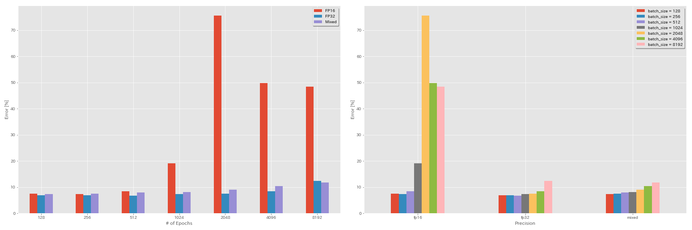

| Model            | precision | batch size | initial lr | lr schedule | # of Epochs | Test Error (1 run) | Training Time |
|:----------------:|:---------:|-----------:|:-----------|:-----------:|------------:|:------------------:|--------------:|
| ResNet-preact-20 |   FP32    |    8192    |   1.6      |    cosine   |     200     |                    |               |
| ResNet-preact-20 |   FP32    |    4096    |   1.6      |    cosine   |     200     |        10.32       |       22m     |
| ResNet-preact-20 |   FP32    |    2048    |   1.6      |    cosine   |     200     |         8.73       |       22m     |
| ResNet-preact-20 |   FP32    |    1024    |   1.6      |    cosine   |     200     |         8.07       |       22m     |
| ResNet-preact-20 |   FP32    |     512    |   0.8      |    cosine   |     200     |         7.73       |       21m     |
| ResNet-preact-20 |   FP32    |     256    |   0.8      |    cosine   |     200     |         7.45       |       21m     |
| ResNet-preact-20 |   FP32    |     128    |   0.4      |    cosine   |     200     |         7.28       |       24m     |

| Model            | precision | batch size | initial lr | lr schedule | # of Epochs | Test Error (1 run) | Training Time |
|:----------------:|:---------:|-----------:|:-----------|:-----------:|------------:|:------------------:|--------------:|
| ResNet-preact-20 |   FP16    |    8192    |   1.6      |    cosine   |     200     |        48.52       |       33m     |
| ResNet-preact-20 |   FP16    |    4096    |   1.6      |    cosine   |     200     |        49.84       |       28m     |
| ResNet-preact-20 |   FP16    |    2048    |   1.6      |    cosine   |     200     |        75.63       |       27m     |
| ResNet-preact-20 |   FP16    |    1024    |   1.6      |    cosine   |     200     |        19.09       |       27m     |
| ResNet-preact-20 |   FP16    |     512    |   0.8      |    cosine   |     200     |         7.89       |       26m     |
| ResNet-preact-20 |   FP16    |     256    |   0.8      |    cosine   |     200     |         7.40       |       28m     |
| ResNet-preact-20 |   FP16    |     128    |   0.4      |    cosine   |     200     |         7.59       |       32m     |

| Model            | precision | batch size | initial lr | lr schedule | # of Epochs | Test Error (1 run) | Training Time |
|:----------------:|:---------:|-----------:|:-----------|:-----------:|------------:|:------------------:|--------------:|
| ResNet-preact-20 |   mixed   |    8192    |   1.6      |    cosine   |     200     |        11.78       |       28m     |
| ResNet-preact-20 |   mixed   |    4096    |   1.6      |    cosine   |     200     |        10.48       |       27m     |
| ResNet-preact-20 |   mixed   |    2048    |   1.6      |    cosine   |     200     |         8.98       |       26m     |
| ResNet-preact-20 |   mixed   |    1024    |   1.6      |    cosine   |     200     |         8.05       |       26m     |
| ResNet-preact-20 |   mixed   |     512    |   0.8      |    cosine   |     200     |         7.81       |       28m     |
| ResNet-preact-20 |   mixed   |     256    |   0.8      |    cosine   |     200     |         7.58       |       32m     |
| ResNet-preact-20 |   mixed   |     128    |   0.4      |    cosine   |     200     |         7.37       |       41m     |

#### Results using Tesla V100

| Model            | precision | batch size | initial lr | lr schedule | # of Epochs | Test Error (1 run) | Training Time |
|:----------------:|:---------:|-----------:|:-----------|:-----------:|------------:|:------------------:|--------------:|
| ResNet-preact-20 |   FP32    |    8192    |   1.6      |    cosine   |     200     |        12.35       |       25m     |
| ResNet-preact-20 |   FP32    |    4096    |   1.6      |    cosine   |     200     |         9.88       |       19m     |
| ResNet-preact-20 |   FP32    |    2048    |   1.6      |    cosine   |     200     |         8.87       |       17m     |
| ResNet-preact-20 |   FP32    |    1024    |   1.6      |    cosine   |     200     |         8.45       |       18m     |
| ResNet-preact-20 |   mixed   |    8192    |   1.6      |    cosine   |     200     |        11.92       |       25m     |
| ResNet-preact-20 |   mixed   |    4096    |   1.6      |    cosine   |     200     |        10.16       |       19m     |
| ResNet-preact-20 |   mixed   |    2048    |   1.6      |    cosine   |     200     |         9.10       |       17m     |
| ResNet-preact-20 |   mixed   |    1024    |   1.6      |    cosine   |     200     |         7.84       |       16m     |


## References

### Model architecture

* He, Kaiming, Xiangyu Zhang, Shaoqing Ren, and Jian Sun. "Deep Residual Learning for Image Recognition." The IEEE Conference on Computer Vision and Pattern Recognition (CVPR), 2016. [link](http://openaccess.thecvf.com/content_cvpr_2016/html/He_Deep_Residual_Learning_CVPR_2016_paper.html), [arXiv:1512.03385](https://arxiv.org/abs/1512.03385)
* He, Kaiming, Xiangyu Zhang, Shaoqing Ren, and Jian Sun. "Identity Mappings in Deep Residual Networks." In European Conference on Computer Vision (ECCV). 2016. [arXiv:1603.05027](https://arxiv.org/abs/1603.05027), [Torch implementation](https://github.com/KaimingHe/resnet-1k-layers)
* Zagoruyko, Sergey, and Nikos Komodakis. "Wide Residual Networks." Proceedings of the British Machine Vision Conference (BMVC), 2016. [arXiv:1605.07146](https://arxiv.org/abs/1605.07146), [Torch implementation](https://github.com/szagoruyko/wide-residual-networks)
* Huang, Gao, Zhuang Liu, Kilian Q Weinberger, and Laurens van der Maaten. "Densely Connected Convolutional Networks." The IEEE Conference on Computer Vision and Pattern Recognition (CVPR), 2017. [link](http://openaccess.thecvf.com/content_cvpr_2017/html/Huang_Densely_Connected_Convolutional_CVPR_2017_paper.html), [arXiv:1608.06993](https://arxiv.org/abs/1608.06993), [Torch implementation](https://github.com/liuzhuang13/DenseNet)
* Han, Dongyoon, Jiwhan Kim, and Junmo Kim. "Deep Pyramidal Residual Networks." The IEEE Conference on Computer Vision and Pattern Recognition (CVPR), 2017. [link](http://openaccess.thecvf.com/content_cvpr_2017/html/Han_Deep_Pyramidal_Residual_CVPR_2017_paper.html), [arXiv:1610.02915](https://arxiv.org/abs/1610.02915), [Torch implementation](https://github.com/jhkim89/PyramidNet), [Caffe implementation](https://github.com/jhkim89/PyramidNet-caffe), [PyTorch implementation](https://github.com/dyhan0920/PyramidNet-PyTorch)
* Xie, Saining, Ross Girshick, Piotr Dollar, Zhuowen Tu, and Kaiming He. "Aggregated Residual Transformations for Deep Neural Networks." The IEEE Conference on Computer Vision and Pattern Recognition (CVPR), 2017. [link](http://openaccess.thecvf.com/content_cvpr_2017/html/Xie_Aggregated_Residual_Transformations_CVPR_2017_paper.html), [arXiv:1611.05431](https://arxiv.org/abs/1611.05431), [Torch implementation](https://github.com/facebookresearch/ResNeXt)
* Gastaldi, Xavier. "Shake-Shake regularization of 3-branch residual networks." In International Conference on Learning Representations (ICLR) Workshop, 2017. [link](https://openreview.net/forum?id=HkO-PCmYl), [arXiv:1705.07485](https://arxiv.org/abs/1705.07485), [Torch implementation](https://github.com/xgastaldi/shake-shake)
* Hu, Jie, Li Shen, and Gang Sun. "Squeeze-and-Excitation Networks." The IEEE Conference on Computer Vision and Pattern Recognition (CVPR), 2018, pp. 7132-7141. [link](http://openaccess.thecvf.com/content_cvpr_2018/html/Hu_Squeeze-and-Excitation_Networks_CVPR_2018_paper.html), [arXiv:1709.01507](https://arxiv.org/abs/1709.01507), [Caffe implementation](https://github.com/hujie-frank/SENet)
* Huang, Gao, Zhuang Liu, Geoff Pleiss, Laurens van der Maaten, and Kilian Q. Weinberger. "Convolutional Networks with Dense Connectivity." IEEE transactions on pattern analysis and machine intelligence (2019). [arXiv:2001.02394](https://arxiv.org/abs/2001.02394)

### Regularization, data augmentation

* Szegedy, Christian, Vincent Vanhoucke, Sergey Ioffe, Jon Shlens, and Zbigniew Wojna. "Rethinking the Inception Architecture for Computer Vision." The IEEE Conference on Computer Vision and Pattern Recognition (CVPR), 2016. [link](http://openaccess.thecvf.com/content_cvpr_2016/html/Szegedy_Rethinking_the_Inception_CVPR_2016_paper.html), [arXiv:1512.00567](https://arxiv.org/abs/1512.00567)
* DeVries, Terrance, and Graham W. Taylor. "Improved Regularization of Convolutional Neural Networks with Cutout." arXiv preprint arXiv:1708.04552 (2017). [arXiv:1708.04552](https://arxiv.org/abs/1708.04552), [PyTorch implementation](https://github.com/uoguelph-mlrg/Cutout)
* Abu-El-Haija, Sami. "Proportionate Gradient Updates with PercentDelta." arXiv preprint arXiv:1708.07227 (2017). [arXiv:1708.07227](https://arxiv.org/abs/1708.07227)
* Zhong, Zhun, Liang Zheng, Guoliang Kang, Shaozi Li, and Yi Yang. "Random Erasing Data Augmentation." arXiv preprint arXiv:1708.04896 (2017). [arXiv:1708.04896](https://arxiv.org/abs/1708.04896), [PyTorch implementation](https://github.com/zhunzhong07/Random-Erasing)
* Zhang, Hongyi, Moustapha Cisse, Yann N. Dauphin, and David Lopez-Paz. "mixup: Beyond Empirical Risk Minimization." In International Conference on Learning Representations (ICLR), 2017. [link](https://openreview.net/forum?id=r1Ddp1-Rb), [arXiv:1710.09412](https://arxiv.org/abs/1710.09412)
* Kawaguchi, Kenji, Yoshua Bengio, Vikas Verma, and Leslie Pack Kaelbling. "Towards Understanding Generalization via Analytical Learning Theory." arXiv preprint arXiv:1802.07426 (2018). [arXiv:1802.07426](https://arxiv.org/abs/1802.07426), [PyTorch implementation](https://github.com/Learning-and-Intelligent-Systems/Analytical-Learning-Theory)
* Takahashi, Ryo, Takashi Matsubara, and Kuniaki Uehara. "Data Augmentation using Random Image Cropping and Patching for Deep CNNs." Proceedings of The 10th Asian Conference on Machine Learning (ACML), 2018. [link](http://proceedings.mlr.press/v95/takahashi18a.html), [arXiv:1811.09030](https://arxiv.org/abs/1811.09030)
* Yun, Sangdoo, Dongyoon Han, Seong Joon Oh, Sanghyuk Chun, Junsuk Choe, and Youngjoon Yoo. "CutMix: Regularization Strategy to Train Strong Classifiers with Localizable Features." arXiv preprint arXiv:1905.04899 (2019). [arXiv:1905.04899](https://arxiv.org/abs/1905.04899)

### Large batch

* Keskar, Nitish Shirish, Dheevatsa Mudigere, Jorge Nocedal, Mikhail Smelyanskiy, and Ping Tak Peter Tang. "On Large-Batch Training for Deep Learning: Generalization Gap and Sharp Minima." In International Conference on Learning Representations (ICLR), 2017. [link](https://openreview.net/forum?id=H1oyRlYgg), [arXiv:1609.04836](https://arxiv.org/abs/1609.04836)
* Hoffer, Elad, Itay Hubara, and Daniel Soudry. "Train longer, generalize better: closing the generalization gap in large batch training of neural networks." In Advances in Neural Information Processing Systems (NIPS), 2017. [link](http://papers.nips.cc/paper/6770-train-longer-generalize-better-closing-the-generalization-gap-in-large-batch-training-of-neural-networks), [arXiv:1705.08741](https://arxiv.org/abs/1705.08741), [PyTorch implementation](https://github.com/eladhoffer/bigBatch)
* Goyal, Priya, Piotr Dollar, Ross Girshick, Pieter Noordhuis, Lukasz Wesolowski, Aapo Kyrola, Andrew Tulloch, Yangqing Jia, and Kaiming He. "Accurate, Large Minibatch SGD: Training ImageNet in 1 Hour." arXiv preprint arXiv:1706.02677 (2017). [arXiv:1706.02677](https://arxiv.org/abs/1706.02677)
* You, Yang, Igor Gitman, and Boris Ginsburg. "Large Batch Training of Convolutional Networks." arXiv preprint arXiv:1708.03888 (2017). [arXiv:1708.03888](https://arxiv.org/abs/1708.03888)
* You, Yang, Zhao Zhang, Cho-Jui Hsieh, James Demmel, and Kurt Keutzer. "ImageNet Training in Minutes." arXiv preprint arXiv:1709.05011 (2017). [arXiv:1709.05011](https://arxiv.org/abs/1709.05011)
* Smith, Samuel L., Pieter-Jan Kindermans, Chris Ying, and Quoc V. Le. "Don't Decay the Learning Rate, Increase the Batch Size." In International Conference on Learning Representations (ICLR), 2018. [link](https://openreview.net/forum?id=B1Yy1BxCZ), [arXiv:1711.00489](https://arxiv.org/abs/1711.00489)
* Gitman, Igor, Deepak Dilipkumar, and Ben Parr. "Convergence Analysis of Gradient Descent Algorithms with Proportional Updates." arXiv preprint arXiv:1801.03137 (2018). [arXiv:1801.03137](https://arxiv.org/abs/1801.03137) [TensorFlow implementation](https://github.com/bparr/lars/blob/master/lars.py)
* Jia, Xianyan, Shutao Song, Wei He, Yangzihao Wang, Haidong Rong, Feihu Zhou, Liqiang Xie, Zhenyu Guo, Yuanzhou Yang, Liwei Yu, Tiegang Chen, Guangxiao Hu, Shaohuai Shi, and Xiaowen Chu. "Highly Scalable Deep Learning Training System with Mixed-Precision: Training ImageNet in Four Minutes." arXiv preprint arXiv:1807.11205 (2018). [arXiv:1807.11205](https://arxiv.org/abs/1807.11205)
* Shallue, Christopher J., Jaehoon Lee, Joseph Antognini, Jascha Sohl-Dickstein, Roy Frostig, and George E. Dahl. "Measuring the Effects of Data Parallelism on Neural Network Training." arXiv preprint arXiv:1811.03600 (2018). [arXiv:1811.03600](https://arxiv.org/abs/1811.03600)
* Ying, Chris, Sameer Kumar, Dehao Chen, Tao Wang, and Youlong Cheng. "Image Classification at Supercomputer Scale." In Advances in Neural Information Processing Systems (NeurIPS) Workshop, 2018. [link](http://learningsys.org/nips18/acceptedpapers.html), [arXiv:1811.06992](https://arxiv.org/abs/1811.06992)

### Others

* Loshchilov, Ilya, and Frank Hutter. "SGDR: Stochastic Gradient Descent with Warm Restarts." In International Conference on Learning Representations (ICLR), 2017. [link](https://openreview.net/forum?id=Skq89Scxx), [arXiv:1608.03983](https://arxiv.org/abs/1608.03983), [Lasagne implementation](https://github.com/loshchil/SGDR)
* Micikevicius, Paulius, Sharan Narang, Jonah Alben, Gregory Diamos, Erich Elsen, David Garcia, Boris Ginsburg, Michael Houston, Oleksii Kuchaiev, Ganesh Venkatesh, and Hao Wu. "Mixed Precision Training." In International Conference on Learning Representations (ICLR), 2018. [link](https://openreview.net/forum?id=r1gs9JgRZ), [arXiv:1710.03740](https://arxiv.org/abs/1710.03740)
* Recht, Benjamin, Rebecca Roelofs, Ludwig Schmidt, and Vaishaal Shankar. "Do CIFAR-10 Classifiers Generalize to CIFAR-10?" arXiv preprint arXiv:1806.00451 (2018). [arXiv:1806.00451](https://arxiv.org/abs/1806.00451)
* He, Tong, Zhi Zhang, Hang Zhang, Zhongyue Zhang, Junyuan Xie, and Mu Li. "Bag of Tricks for Image Classification with Convolutional Neural Networks." arXiv preprint arXiv:1812.01187 (2018). [arXiv:1812.01187](https://arxiv.org/abs/1812.01187)


